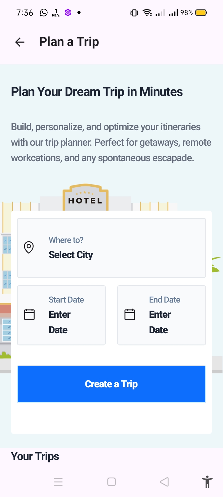

# **Trip Planner App**

A beautiful and user-friendly native Android app built with **Kotlin** and **Jetpack Compose** for managing your trips. The app allows users to create and view trip details with a sleek interface.

## **Features**

- **Create Trips**: Users can add trip details, including trip name, start and end dates, description, and travel style.
- **View Trips**: A list of created trips is displayed, showcasing the trip name, dates, and description.
- **Modern UI**: Built using Jetpack Compose for a declarative UI.
- **Clean Architecture**: Organized in a clear structure using modern Android development practices.
- **Design Pattern**: Used the MVI design pattern.
- **Dependency Injection**: Used dependency injection using daggerhilt.
- **API Request**: Used retrofit for making API Request to create, retrieve and view trips.
- **Navigation**: Used Compose Navigation for navigation and passing data btween trip screens

## **Installation Guide**

### **Prerequisites**

Before installing the app, ensure you have the following installed:

- **Android Studio** (version 7.0 or higher)
- **Kotlin** (latest stable version)
- **Android SDK** (latest stable version)

### **Steps to Install**

1. **Clone the Repository**  
   Clone the project from GitHub: https://github.com/abduleneye/VoyaTekTripAssessmentApp.git

3. **Open the Project in Android Studio**
Launch Android Studio
Select Open an existing project.
Navigate to the project directory and select the folder where the project is saved.

4. **Set Up Dependencies**

Android Studio should automatically prompt you to sync the project with Gradle. If not, click Sync Now in the toolbar to sync the dependencies.
Make sure all dependencies are properly installed by checking the Gradle Sync status.

4. **Build the Project**

Once the project syncs successfully, click on Build > Rebuild Project to make sure everything compiles correctly.

5. **Run the App**

Connect a physical device or start an emulator.
Click the Run button in Android Studio (the green triangle) to launch the app on your device or emulator.

6. **Permissions**

The app requires Internet permissions to connect to APIs. Ensure the necessary permissions are added in the AndroidManifest.xml.

**HTTP Endpoint**

The app uses Retrofit for network operations.

Base URL: https://trips.free.beeceptor.com/

Get Trip End point: get_trips

Create Trip End point: create_trip

<table>
  <tr>
    <td align="center">
      
       Screenshot 1
    </td>
    <td align="center">
      
       Screenshot 2
    </td>
     <td align="center">
      
       Screenshot 3
    </td>
    <td align="center">
      
       Screenshot 4
    </td>
      <td align="center">
      
       Screenshot 6
    </td>
     <td align="center">
      
       Screenshot 5
    </td>
      </td>
     <td align="center">
      
       Screenshot 7
    </td>
    <td align="center">
      
       Screenshot 8
    </td>
    </td>
      </td>
  </tr>
</table>

